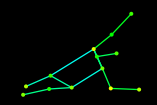

# Leed2Json
Functions that reference a json file created from lspetdata. I will add the other one, too.  I will also add a few (just a few) functions to access it the data.  I created a constant that holds the json so that it can be used in whatever package you want.

If you are using this please reference the original creator of the data set the reference is below.  You don't have to reference me, but you can if you want to ;).
 
## Images Location
Leeds Sports Pose Extended Training Dataset
Sam Johnson and Mark Everingham
http://sam.johnson.io/research/lspet.html

## Reference
@inproceedings{Johnson11,
   title = {Learning Effective Human Pose Estimation from Inaccurate Annotation},
   author = {Johnson, Sam and Everingham, Mark},
   year = {2011},
   booktitle = {Proceedings of Computer Vision and Pattern Recognition (CVPR) 2011}
}

E-mail: s.a.johnson04@leeds.ac.uk

